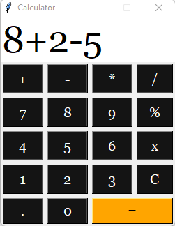

# Simple Calculator

This calculator performs arithmetic operations on numbers and can do only addition, subtraction, multiplication and division mathematical calculations.

<a href="https://github.com/alidehkhodaei/SimpleCalculator/raw/main/Calculator.exe">Click here</a> to download the exe file.

## Screenshots



## Converting Tkinter program to exe file

First install the package in the environment by using the following command.
```
pip install pyinstaller
```
After install above package, type this command and press Enter.
```
pyinstaller --onefile -w locationFile
```
Now, check the location of the file (script file) and you will find a dist folder which contains the executable file in it.
